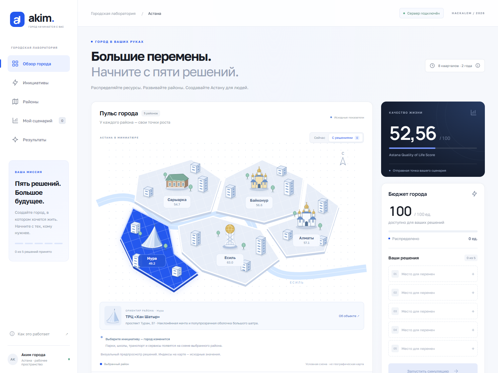
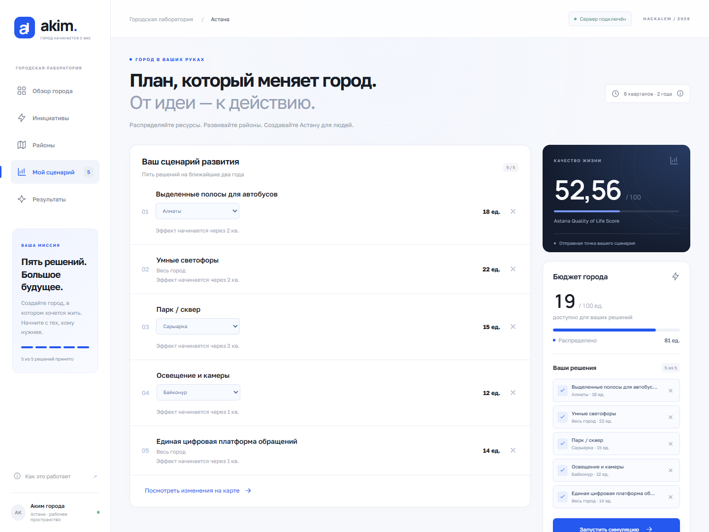
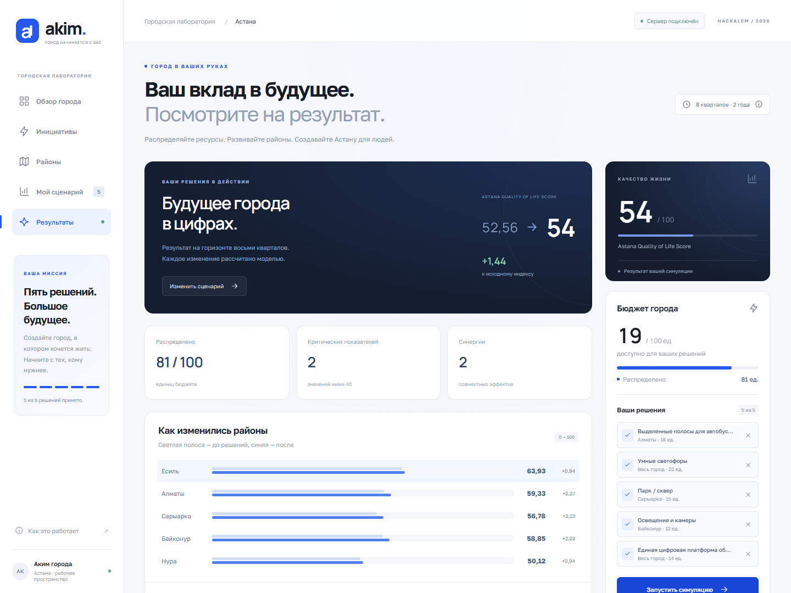

# HackAlem: «Аким на 5 часов»

Учебный симулятор управления городом от команды **East Vision**. Пользователь выбирает пять инициатив в рамках бюджета и сравнивает их влияние на районы Астаны. Backend рассчитывает показатели и рейтинг качества жизни, а OpenAI помогает сформулировать анализ.

**Данные синтетические.** Проект предназначен для хакатона и не прогнозирует реальные последствия городских решений. Числовая симуляция работает и без ключа OpenAI.

## Скриншоты

**Обзор города:** схема пяти районов, исходный рейтинг и бюджет.

[](docs/screenshots/overview.png)

| Пять решений в рамках бюджета | Результат симуляции |
| --- | --- |
| [](docs/screenshots/scenario.png) | [](docs/screenshots/results.png) |

Реальные экраны контрольного сценария из раздела демонстрации. Нажмите на изображение, чтобы открыть его в полном размере.

## Основные возможности

- Пять районов: Есиль, Алматы, Сарыарка, Байконур и Нура.
- Каталог из 14 инициатив: транспорт, экология, социальная сфера, безопасность и городские сервисы.
- Выбор районных и общегородских мер, контроль бюджета и совместимости.
- Интерактивная схема города с режимами «Сейчас» и «С решениями».
- Расчёт на 8 кварталов: изменения показателей, Score, критические значения и синергии.
- Анализ результата: вывод, сильные стороны, риски, компромиссы и рекомендации.

Карта условная, не географическая. «Алматы» здесь означает район Астаны. Пятичасового таймера в приложении нет.

## Стек и архитектура

| Часть | Технологии |
| --- | --- |
| Frontend | React 18, JavaScript/JSX, Vite 6, CSS, SVG, Fetch API |
| Backend | Python, FastAPI 0.115.6, Uvicorn 0.32.1, Pydantic 2.10.3 |
| AI | OpenAI Python SDK `>=3.14.1,<4.0.0`, Responses API, Structured Output |
| Настройки и тесты | python-dotenv, unittest, FastAPI TestClient |

```text
Пользователь -> React -> FastAPI
                          |
                          +-> Валидация -> Симуляция -> Score
                          |
                          +-> Факты backend -> OpenAI -> Проверка анализа
                          |
                    JSON-ответ -> Экран результатов
```

Frontend собирает сценарий и показывает результат. Backend отвечает за правила, расчёты и обращения к OpenAI. AI не рассчитывает Score и не меняет числовые результаты.

Базы данных нет: исходные данные находятся в Python-коде, выбранный сценарий хранится в памяти React. Каждый расчёт начинается с исходного состояния.

## Быстрый запуск

### Требования

- Git, Node.js **22.x** и npm.
- Python **3.10+** по синтаксису кода; backend-тесты проверены на **3.13**.
- pip и venv; интернет для установки зависимостей.
- Ключ OpenAI и доступ к сервису нужны только для AI-анализа.

Отдельная версия Node в проекте не закреплена; 22.x подходит требованиям Vite. Полная матрица совместимости Python не задана.

### 1. Клонирование

```sh
git clone https://github.com/BAITC-Hacks/hack-6712142d-east-vision.git Hackalem
cd Hackalem
```

Если репозиторий уже скачан, откройте его корень. Все следующие пути указаны относительно папки `Hackalem`.

### 2. Backend: терминал 1

**Windows PowerShell, из корня проекта:**

```powershell
cd backend
python -m venv .venv
.\.venv\Scripts\Activate.ps1
python -m pip install -r requirements.txt
```

**Linux/macOS, из корня проекта:**

```bash
cd backend
python3 -m venv .venv
source .venv/bin/activate
python -m pip install -r requirements.txt
```

Для AI настройте `backend/.env` по следующему разделу; без AI файл необязателен. Затем из `backend` запустите:

```sh
python -m uvicorn main:app --reload --host 127.0.0.1 --port 8000
```

Запускайте именно из `backend`: текущие импорты рассчитаны на эту рабочую папку. В новом терминале повторно активируйте окружение; переустанавливать пакеты каждый раз не нужно.

### 3. Frontend: терминал 2

**Из корня проекта:**

```sh
cd frontend
npm install
npm run dev -- --host 127.0.0.1 --port 5173
```

Откройте **http://127.0.0.1:5173**. Если порт занят, Vite может выбрать следующий: используйте адрес из терминала. Даже если `node_modules` уже есть после клонирования, выполните `npm install`.

Оба сервера должны работать одновременно. Для остановки используйте `Ctrl+C`. Без backend интерфейс показывает демоданные, но расчёт отключён.

### Адреса

| Адрес | Назначение |
| --- | --- |
| http://127.0.0.1:5173 | Приложение |
| http://127.0.0.1:8000/api/health | Проверка backend |
| http://127.0.0.1:8000/docs | Swagger UI: документация и отправка запросов |
| http://127.0.0.1:8000/redoc | Документация ReDoc |
| http://127.0.0.1:8000/openapi.json | Полная схема API |

На `http://127.0.0.1:8000/` нет главной страницы: ответ `404` на этом пути ожидаем.

## Настройка .env

### Backend: `backend/.env`

Файла `.env.example` сейчас нет. Минимальный пример по реальным настройкам кода:

```dotenv
# Оставьте пустым для запуска без AI; для AI укажите свой ключ локально.
OPENAI_API_KEY=
OPENAI_MODEL=gpt-4o-mini
```

| Переменная | Назначение |
| --- | --- |
| `OPENAI_API_KEY` | Необязательный для симуляции секретный ключ OpenAI |
| `OPENAI_MODEL` | Модель; при пустом или отсутствующем значении используется `gpt-4o-mini` |

Файл должен называться `.env`, а не `.env.txt`. Backend читает его рядом с `config.py`, независимо от расположения других env-файлов.

**Переменные процесса имеют приоритет над файлом, даже если пустые.** Поэтому старое значение в терминале или настройках запуска IDE может перекрыть ключ из `.env`. После изменения окружения процесса перезапустите backend.

Не коммитьте ключ и не передавайте его во frontend. `.env` исключён через `.gitignore`, но это не защищает уже закоммиченные секреты.

### Frontend: `frontend/.env.local`

Необязательная настройка для другого адреса backend:

```dotenv
VITE_API_URL=http://127.0.0.1:8000
```

Это также адрес по умолчанию в `src/api/api.js`. Указывайте базовый URL **без `/api`**: пути добавляет API-клиент. После изменения перезапустите Vite; собранную версию нужно пересобрать.

Переменные `VITE_*` доступны браузеру. Секреты в них хранить нельзя.

## API

Все прикладные запросы и ответы используют JSON. Авторизации, загрузки изображений и `multipart/form-data` нет.

| Метод | Endpoint | Вход | Ответ |
| --- | --- | --- | --- |
| `GET` | `/api/health` | Без тела | `{"status":"ok"}` |
| `GET` | `/api/data` | Без тела | `districts`, `indicators`, `initiatives`, `budget` |
| `POST` | `/api/simulate` | Массив `decisions` | Расчёт сценария и `ai_analysis` |

`/api/data` возвращает 5 районов, 10 показателей, 14 инициатив и бюджет 100. У района есть `population_share` и `indicators`; у инициативы: `id`, `category`, `name`, `type`, `cost`, `lag`, `effects`.

### Пример POST /api/simulate

В `/docs` откройте endpoint, нажмите **Try it out**, вставьте JSON и нажмите **Execute**. Для программного запроса задайте `Content-Type: application/json`.

```json
{
  "decisions": [
    {"initiative_id": "M1", "district": "Алматы"},
    {"initiative_id": "M2", "district": null},
    {"initiative_id": "M4", "district": "Сарыарка"},
    {"initiative_id": "M10", "district": "Байконур"},
    {"initiative_id": "M12", "district": null}
  ]
}
```

Для районной меры требуется точное название района из `/api/data`. Для городской меры `district` равен `null` или отсутствует.

**Сокращённый ответ без AI**; остальные поля описаны ниже:

```json
{
  "valid": true,
  "used_budget": 81,
  "remaining_budget": 19,
  "baseline_score": 52.56,
  "final_score": 54.0,
  "score_delta": 1.44,
  "critical_indicators": [
    {"district": "Нура", "indicator": "S1", "value": 38.0},
    {"district": "Нура", "indicator": "S2", "value": 35.0}
  ],
  "ai_analysis": {
    "summary": "AI-анализ временно недоступен. Числовой результат симуляции рассчитан успешно.",
    "strengths": [],
    "risks": [],
    "tradeoffs": [],
    "recommendations": []
  }
}
```

Полный ответ также содержит `decisions`, `final_districts`, `changes` с `before/after/delta`, `applied_synergies`, `initiative_contributions`, `score` и `ai_summary`. Последнее поле дублирует `ai_analysis.summary`. Точные схемы: [backend/models.py](backend/models.py) и `/docs`.

### Ошибки

| Статус | Причина |
| --- | --- |
| `400` | Нарушены правила сценария: бюджет, количество, повторы, районы или совместимость |
| `422` | Некорректный JSON, отсутствующие поля или неверные типы |
| `404 / 405` | Неверный путь / HTTP-метод |
| `500` | Внутренняя ошибка; подробности в терминале backend |

Например, `{"decisions":[]}` возвращает `400` с `{"detail":"Нужно выбрать ровно 5 решений."}`. При неверной структуре `detail` содержит список ошибок проверки.

Ошибка OpenAI не отменяет допустимый расчёт: сервер возвращает `200` с резервным анализом. Недоступный сервер вообще не возвращает HTTP-ответ.

## Рейтинг и основная логика

Правила выбора: **ровно 5 разных инициатив**, стоимость **не выше 100**, не более **2 мер одной категории**. M1 и M3 несовместимы глобально; M4/M7 и M5/M13 нельзя выбирать в одном районе.

| Коды | Показатели |
| --- | --- |
| T1 / T2 | Разгрузка дорог / доступность общественного транспорта |
| E1 / E2 | Озеленение / качество воздуха |
| S1 / S2 | Школы и детсады / поликлиники |
| B1 / B2 | Безопасность улиц / безопасность дорожного движения |
| C1 / C2 | Надёжность ЖКХ / скорость решения обращений |

1. Эффект меры умножается на `(8 - lag) / 8`, где `lag` задаётся в кварталах.
2. Районная мера применяется к одному району, городская ко всем.
3. Добавляются синергии: M1+M2 дают T1 +2 в районе M1; M10+M12 дают B1 +2 в районе M10; M5+M6 дают E2 +2 в районе M5.
4. Показатели ограничиваются диапазоном 0–100. Значение **строго ниже 40** считается критическим.

```text
Индекс района = сумма(показатель * вес)
d_avg = сумма(индекс района * доля населения района)
n_crit = число показателей ниже 40 во всех районах
Score = 0.7 * d_avg + 0.3 * минимальный индекс района - n_crit
```

Данные и веса находятся в `data.py`, расчёты в `simulation.py` и `score.py`. Формула использует неокруглённые значения; отображаемый Score округляется до двух знаков. Остаток бюджета бонуса не даёт.

`initiative_contributions` показывает прямой эффект мер с учётом задержки. Полная `delta` также учитывает другие меры, синергии и ограничение диапазона.

## Как работает AI

`scenario_service.py` вызывает `ai_service.py` после расчёта. `analysis_facts.py` программно собирает изменение Score, три крупнейших улучшения, все критические показатели, отрицательные изменения, синергии, незатронутые проблемы и рекомендации из каталога.

OpenAI получает только эти факты и возвращает структуру `AIAnalysis`. Таймаут SDK составляет **15 секунд**, автоматические повторы отключены.

После успешного ответа `analysis_formatter.py` проверяет вывод и заново формирует четыре списка анализа из фактов backend, максимум по три пункта. Все критические показатели объединяются в пункт рисков. Нулевая `delta` сама по себе не считается преимуществом или риском, остаток бюджета является информацией.

**Без ключа или при ошибке AI** возвращается резервный текст и пустые списки анализа. Числа и отдельный список `critical_indicators` сохраняются. Причину ошибки OpenAI ищите в backend-логе.

## Демонстрационный сценарий для хакатона

1. Покажите исходные показатели Нуры: S1=38 и S2=35.
2. В каталоге соберите набор из примера API:

| ID | Мера | Район | Стоимость |
| --- | --- | --- | ---: |
| M1 | Выделенные полосы для автобусов | Алматы | 18 |
| M2 | Умные светофоры | Весь город | 22 |
| M4 | Парк / сквер | Сарыарка | 15 |
| M10 | Освещение и камеры | Байконур | 12 |
| M12 | Единая цифровая платформа обращений | Весь город | 14 |

3. Нажмите **«Запустить симуляцию»**: бюджет **81/100**, остаток **19**, Score **52.56 → 54.00 (+1.44)**.
4. Покажите две синергии и то, что S1=38 и S2=35 в Нуре остались критическими.
5. При успешном AI-анализе обе проблемы присутствуют в рисках, а рекомендации содержат M7 «Школа + детсад» и M8 «Центр семейного здоровья / поликлиника» для Нуры.

Этот пример иллюстрирует улучшение общего результата без решения всех проблем. Он не является оптимальным набором мер. Изменение выбора сбрасывает предыдущий результат.

## Структура проекта

```text
Hackalem/
|-- README.md
|-- backend/
|   |-- main.py, routes.py             # Приложение, CORS и endpoint'ы
|   |-- config.py, models.py           # Настройки и схемы API
|   |-- scenario_service.py           # Сборка результата сценария
|   |-- data.py, validator.py          # Каталог и правила выбора
|   |-- simulation.py, score.py        # Эффекты и рейтинг
|   |-- ai_service.py                 # Вызов OpenAI и резервный ответ
|   |-- analysis_facts.py              # Факты и подбор рекомендаций
|   |-- analysis_formatter.py          # Итоговые разделы анализа
|   |-- requirements.txt
|   `-- tests/                        # API, настройки, AI-интеграция
`-- frontend/
    |-- package.json, package-lock.json
    |-- index.html
    `-- src/
        |-- main.jsx, App.jsx         # Точка входа и компоновка
        |-- Results.jsx, CityMap.jsx  # Результаты и схема города
        |-- components/               # Каталог, сценарий, панели, справка
        |-- hooks/useScenario.js      # Состояние и запуск сценария
        |-- api/api.js                # Запросы, ошибки и таймауты
        |-- constants/, presentation.js
        |-- demoData.json, weights.json
        `-- *.css                     # Стили приложения
```

Новый endpoint добавляется в `routes.py`, схемы в `models.py`; расчёты остаются в соответствующих сервисных модулях. API-запросы frontend находятся в `src/api/api.js`, UI-компоненты в `src/components/`.

## Проверка работоспособности

- `GET /api/health` возвращает `{"status":"ok"}`; эта проверка не проверяет OpenAI.
- В интерфейсе появляется «Сервер подключён», контрольный сценарий даёт Score **54.00**.
- Если backend запущен после frontend, нажмите «Повторить подключение». Успешное подключение сбросит текущий выбор.

**Backend**, из `backend` с активированным окружением:

```sh
python -m unittest discover -s tests -v
```

В проекте 11 тестов; вызовы OpenAI подменяются, настоящий ключ не требуется.

**Frontend**, из `frontend`:

```sh
npm run build
npm run preview -- --host 127.0.0.1 --port 4173
```

Preview показывает сборку из `dist`; backend всё равно нужен отдельно. Команды `npm test` нет.

## Типичные проблемы запуска

| Проблема | Что проверить |
| --- | --- |
| `node/npm/python` не найдены | Установку инструментов и PATH; после установки откройте терминал заново. На Linux/macOS используйте `python3` до активации окружения |
| PowerShell блокирует активацию | Из `backend` используйте `.\.venv\Scripts\python.exe -m pip install -r requirements.txt` и тот же Python для `-m uvicorn main:app ...` |
| PowerShell блокирует `npm.ps1` | Используйте `npm.cmd` вместо `npm` |
| `ModuleNotFoundError: fastapi/openai/dotenv` | Активируйте нужный `.venv`, выполните `python -m pip install -r requirements.txt`; наличие папки окружения не означает наличие пакетов |
| Не найдены `config/routes/models` | Запускайте backend из папки `backend` |
| Деморежим или `Failed to fetch` | Проверьте `/api/health`, `/api/data`, адрес `VITE_API_URL` и перезапустите Vite |
| CORS error | CORS уже разрешён в `config.py`; проверьте, что на выбранном порту запущен именно этот backend, и посмотрите его лог |
| `400` или `422` | В браузере откройте Network и прочитайте `detail`: правила выбора или структура JSON |
| Порт занят | Остановите свой старый процесс или смените порт; при смене backend-порта обновите `VITE_API_URL` |
| Ошибка `.map` после обновления | Перезапустите обе актуальные версии, обновите зависимости, сверяйте ответ API со схемой в `/docs` |
| AI недоступен при наличии ключа | Проверьте путь `.env`, приоритет переменных процесса, доступ к модели и сообщение ошибки в backend-логе |

Проверить загрузку ключа **без вывода секрета**, из `backend`:

```sh
python -c "from config import ENV_FILE, get_setting; print('env_exists:', ENV_FILE.is_file()); print('key_configured:', bool(get_setting('OPENAI_API_KEY')))"
```

`True` означает наличие значения, а не успешный доступ к OpenAI. API-клиент frontend ожидает загрузку данных до 5 секунд, симуляцию до 25 секунд.

## Ограничения MVP

- Фиксированные синтетические данные и горизонт расчёта; нет подключения к реальной городской статистике.
- Нет аккаунтов, базы данных, сохранения или истории сценариев. Перезагрузка страницы сбрасывает выбор.
- Без backend доступен только демонстрационный интерфейс; без OpenAI остаётся числовой расчёт.
- Рекомендации не являются готовым новым сценарием: они не гарантируют соблюдение бюджета и совместимости.
- Проверка AI-вывода основана на строковых правилах, а не на полной проверке истинности текста.
- Демо-данные и часть frontend-правил дублируют backend и требуют синхронизации при изменениях модели.
- CORS открыт, авторизации и ограничения частоты запросов нет. Публичный запуск с AI-ключом требует дополнительной защиты.
- Нет готового production-развёртывания и frontend-автотестов. Часть `node_modules` и Python-кешей уже отслеживается Git; проверяйте состав коммита.
